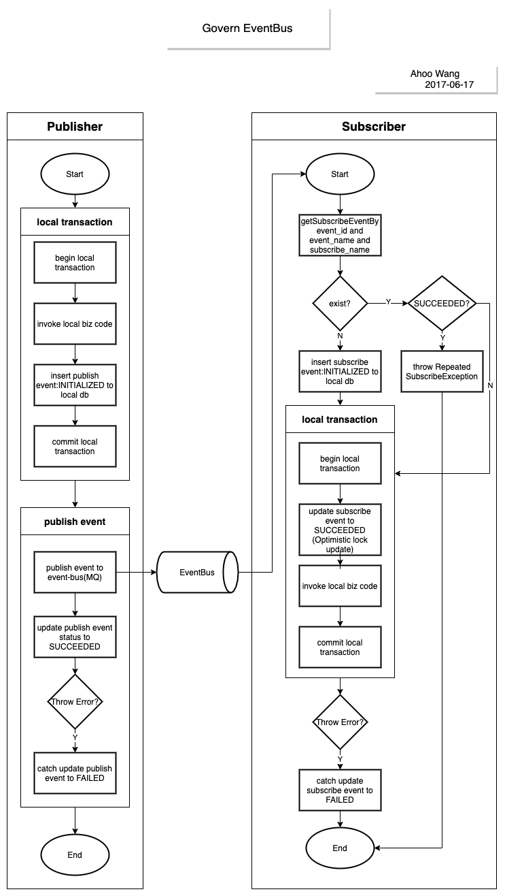

# Govern EventBus

*Govern EventBus* 是一个历经四年生产环境验证的*事件驱动架构*框架， 通过事件总线机制来治理微服务间的远程过程调用。
使用本地事务来支持微服务内强一致性，事件总线来实现微服务间的最终一致性，另外还提供了事件发布/订阅失败的自动补偿机制。

## 执行流

<p align="center"></p>

## 安装

### 初始化 db

``` sql
create table compensate_leader
(
    name varchar(16) not null
        primary key,
    term_start bigint unsigned not null,
    term_end bigint unsigned not null,
    transition_period bigint unsigned not null,
    leader_id varchar(100) not null,
    version int unsigned not null
);

create table publish_event
(
    id bigint unsigned auto_increment
        primary key,
    event_name varchar(100) not null,
    event_data mediumtext not null,
    status smallint unsigned not null,
    published_time bigint unsigned default 0 not null,
    version smallint unsigned not null,
    create_time bigint unsigned not null
);

create index idx_status
    on publish_event (status);

create table publish_event_compensate
(
    id bigint unsigned auto_increment
        primary key,
    publish_event_id bigint unsigned not null,
    start_time bigint unsigned not null,
    taken bigint unsigned not null,
    failed_msg text null
);

create table publish_event_failed
(
    id bigint unsigned auto_increment
        primary key,
    publish_event_id bigint unsigned not null,
    failed_msg text not null,
    create_time bigint unsigned not null
);

create table subscribe_event
(
    id bigint unsigned auto_increment
        primary key,
    subscribe_name varchar(100) not null,
    status smallint unsigned not null,
    subscribe_time bigint unsigned not null,
    event_id bigint unsigned not null,
    event_name varchar(100) not null,
    event_data mediumtext not null,
    event_create_time bigint unsigned not null,
    version smallint unsigned not null,
    create_time bigint unsigned not null,
    constraint uk_subscribe_name_even_id_event_name
        unique (subscribe_name, event_id, event_name)
);

create index idx_status
    on subscribe_event (status);

create table subscribe_event_compensate
(
    id bigint unsigned auto_increment
        primary key,
    subscribe_event_id bigint unsigned not null,
    start_time bigint unsigned not null,
    taken int unsigned not null,
    failed_msg text null
);

create table subscribe_event_failed
(
    id bigint unsigned auto_increment
        primary key,
    subscribe_event_id bigint unsigned not null,
    failed_msg text not null,
    create_time bigint unsigned not null
);

insert into compensate_leader
(name, term_start, term_end, transition_period, leader_id, version)
values ('publish_leader', 0, 0, 0, '', 0);

insert into compensate_leader
(name, term_start, term_end, transition_period, leader_id, version)
values ('subscribe_leader', 0, 0, 0, '', 0);

```

### Gradle

```kotlin
    val eventbusVersion = "0.9.2";
    implementation("me.ahoo.eventbus:eventbus-spring-boot-starter:${eventbusVersion}")
    implementation("me.ahoo.eventbus:eventbus-spring-boot-autoconfigure:${eventbusVersion}") {
        capabilities {
            requireCapability("me.ahoo.eventbus:rabbit-bus-support")
            //requireCapability("me.ahoo.eventbus:kafka-bus-support")
        }
    }
```

### Maven

```xml
<?xml version="1.0" encoding="UTF-8"?>

<project xmlns="http://maven.apache.org/POM/4.0.0"
         xmlns:xsi="http://www.w3.org/2001/XMLSchema-instance"
         xsi:schemaLocation="http://maven.apache.org/POM/4.0.0 http://maven.apache.org/xsd/maven-4.0.0.xsd">

    <modelVersion>4.0.0</modelVersion>
    <artifactId>demo</artifactId>
    <properties>
        <eventbus.version>0.9.2</eventbus.version>
    </properties>

    <dependencies>
        <dependency>
            <groupId>me.ahoo.eventbus</groupId>
            <artifactId>eventbus-spring-boot-starter</artifactId>
            <version>${eventbus.version}</version>
        </dependency>
        <dependency>
            <groupId>me.ahoo.eventbus</groupId>
            <artifactId>eventbus-rabbit</artifactId>
            <version>${eventbus.version}</version>
        </dependency>
        <!--<dependency>-->
        <!--    <groupId>me.ahoo.eventbus</groupId>-->
        <!--    <artifactId>eventbus-kafka</artifactId>-->
        <!--    <version>${eventbus.version}</version>-->
        <!--</dependency>-->
    </dependencies>
</project>
```

### Spring Boot Application Config

```yaml
spring:
  application:
  name: eventbus-demo
  datasource:
    url: jdbc:mysql://localhost:3306/eventbus_db?serverTimezone=GMT%2B8&characterEncoding=utf-8
    username: root
    password: root
  rabbitmq:
    host: localhost
    username: eventbus
    password: eventbus

govern:
  eventbus:
    rabbit:
      exchange: eventbus
    compensate:
      db:
        publish:
          schedule:
            initial-delay: 30
            period: 10
        subscribe:
          schedule:
            initial-delay: 30
            period: 10
        enabled: true
    subscriber:
      prefix: ${spring.application.name}.
```

## 快速上手

> 一般情况下 *Publisher* 与 *Subscriber* 不在同一个应用服务内。
> 这里只是作为演示用途。

> [Demo](./eventbus-demo)

### Publisher

```java
/**
 * 定义发布事件
 */
public class OrderCreatedEvent {
    private long orderId;

    public long getOrderId() {
        return orderId;
    }

    public void setOrderId(long orderId) {
        this.orderId = orderId;
    }

    @Override
    public String toString() {
        return "OrderCreatedEvent{" +
                "orderId=" + orderId +
                '}';
    }
}
```

```java
package me.ahoo.eventbus.demo.service;

import me.ahoo.eventbus.core.annotation.Publish;
import me.ahoo.eventbus.demo.event.OrderCreatedEvent;
import org.springframework.stereotype.Service;

/**
 * @author ahoo wang
 */
@Service
public class OrderService {

    @Publish
    public OrderCreatedEvent createOrder() {
        OrderCreatedEvent orderCreatedEvent = new OrderCreatedEvent();
        orderCreatedEvent.setOrderId(1L);
        return orderCreatedEvent;
    }
}
```

### Subscriber

```java
package me.ahoo.eventbus.demo.service;

import lombok.extern.slf4j.Slf4j;
import me.ahoo.eventbus.core.annotation.Subscribe;
import me.ahoo.eventbus.demo.event.OrderCreatedEvent;
import org.springframework.stereotype.Service;

@Slf4j
@Service
public class NoticeService {

    @Subscribe
    public void handleOrderCreated(OrderCreatedEvent orderCreatedEvent) {
        log.info("handleOrderCreated - event:[{}].", orderCreatedEvent);
        /**
         * 执行相应的业务代码
         * send sms / email ?
         */
    }
}
```
